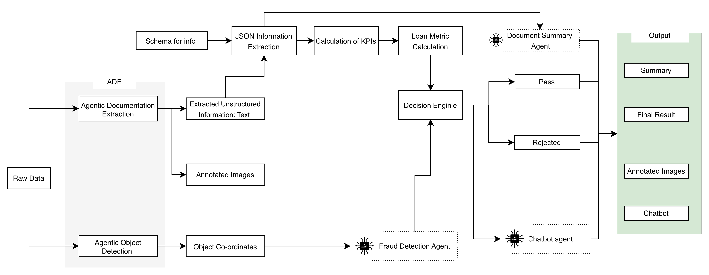

# LoanLens AI - Intelligent Loan Processing and Fraud Detection
*Your Virtual Underwriter — From Documents to Decisions, Instantly*  
Powered by **<a href="https://landing.ai/">Landing AI</a> 🚀** and **<a href="https://aws.amazon.com/documentation-overview/bedrock/">AWS Bedrock</a>**

**LoanLens AI** is an intelligent, end-to-end underwriting assistant that automates financial document analysis, fraud detection, and credit decisioning with speed, accuracy, and transparency.

---
### 🎬 Watch Demo
<p>
  <a href="https://www.youtube.com/watch?v=iKqOY-Nobv8" target="_blank">
    </img>
  </a>
</p>

---

## 🚨 Problem Statement

Manual loan underwriting processes are **time-consuming**, **error prone**, and highly susceptible to **inconsistencies and fraud** due to fragmented document review and the lack of intelligent automation. Financial institutions face increasing pressure to accelerate credit decisions, improve risk assessment, and meet rising regulatory standards — all while reducing operational costs. 

LoanLens AI addresses this challenge by automating document extraction, fraud detection, and credit evaluation using an AI-first, multi-agent architecture to deliver faster, more accurate, and auditable underwriting decisions.

### 📊 Key Metrics Highlighting the Problem
- **52% of loan processing time** is spent manually collecting and verifying documents, leading to delayed decisions and higher operational costs. (Source: <a href="https://argyle.com/blog/history-of-mortgage-lending/">argyle.com</a>)
- **5% loan applications** contain discrepancies or altered documents, raising significant fraud risks. (Source: <a href="https://arya.ai/blog/how-to-spot-fake-loan-documents">arya.ai</a>)
- **Up to 30% of creditworthy applicants** are rejected due to poor data interpretation or lack of context in traditional underwriting. (Source: <a href="https://tink.com/blog/open-banking/underwriting-challenges-solution/">tink.com</a>)
- **32% of lenders** cite difficulty in assessing borrower affordability due to inconsistent or unstructured income documentation. (Source:<a href="https://www.infrrd.ai/blog/why-mortgage-income-calculation-verification-matters-more-than-ever-in-2025">infrrd.ai</a>)
- **19% of banks** are still using semi-automated underwriting process (Source:<a href="https://klearstack.com/automated-underwriting-systems">klearstack.com</a>)
- **Almost 20% of all financial‑fraud complaints** in the U.S. involved identity theft—loan application fraud being a major sub‑category.(Source: <a href="https://kpmg.com/kpmg-us/content/dam/kpmg/pdf/2025/fraud-identity-theft-other-scams-reg-alert..pdf">kpmg.com</a>)
- **Over 60% of fraudulent personal loan application documents** match the pattern of first-party fraud. These individuals are inflating their salaries or hiding evidence of risky revenue practices and present a much higher risk of delinquency. (Source: <a href="https://www.inscribe.ai/blog/12-common-red-flags-for-loan-application-fraud">inscribe.ai/</a>)

---

## 💡 User Story
As a **loan officer or underwriting analyst**,
I want an **AI-powered assistant** that can automatically extract, validate, and analyze borrower documents across multiple formats,
so that I can make **faster, more accurate, and fraud-resistant credit decisions** with full transparency and auditability.


**Example:**  
John, a credit underwriter at a large retail bank, reviews hundreds of loan applications daily.<br>
Traditionally, he manually verifies bank statements, payslips, and ID proofs — a slow and error-prone process.<br>
<br>
With **LoanLens AI**, John uploads the borrower’s documents, and the system automatically:
- Extracts data using **Landing AI ADE** from PDFs and images,
- Calculates KPIs like **debt-to-income ratio, Credit Score, and income stability**
- Runs **fraud detection** to flag anomalies or tampered files, and
- Provides a weighted loan eligibility score along with a chat interface to query details like

*Instead of spending hours on manual checks, John can now make confident, data-driven lending decisions in minutes - improving turnaround time, accuracy, and customer satisfaction.*

## Few More Examples

---

## ⚙️ Key Features

Here’s a **Key Features Table** for LoanLens AI <br>
<table>
  <thead>
    <tr>
      <th>Feature Category</th>
      <th>Key Capabilities</th>
    </tr>
  </thead>
  <tbody>
    <tr>
      <td><b>Automated Document Ingestion</b></td>
      <td>
        Accepts borrower-submitted documents such as:
        <ul>
          <li>Bank Statements</li>
          <li>Income Proofs (Payslip)</li>
          <li>Identity Documents (Passport)</li>
          <li>Tax Statements</li>
          <li>Credit Reports</li>
          <li>Utility Bills</li>
        </ul>
      </td>
    </tr>
    <tr>
      <td><b>Structured Data Extraction<br>
       using Landing AI ADE <br>(Agentic Data Extraction) <br>& AOD (Agentic Object Extraction)</b></td>
      <td>
        Uses Landing AI ADE to:
        <ul>
          <li>Extract Information from docs using ADE</li>
          <li>Calculate KPIs on the documents</li>
          <li>Calculate Loan Metrics</li>
          <li>Decide Final outcome by:
            <ul>
              <li>Weighted Engine</li>
              <li>Rejection rules by Fraud Detection Agent</li>
            </ul>
          </li>
        </ul>
      </td>
    </tr>
    <tr>
      <td><b>KPI & Loan Metric Calculation</b></td>
      <td>
        Computes borrower health indicators:
        <ul>
          <li>Credit Score</li>
          <li>Default Risk</li>
          <li>DTI (Debt-to-Income) Score</li>
          <li>Account Liquidity</li>
          <li>Income Stability</li>
          <li>Address Stability</li>
        </ul>
      </td>
    </tr>
    <tr>
      <td><b>Credit Decisioning Engine</b></td>
      <td>
        Final outcome determined using:
        <ul>
          <li>Scoring rules</li>
          <li>Hard rejection criteria for immediate flagging</li>
        </ul>
      </td>
    </tr>
    <tr>
      <td><b>Fraud Detection Module using Agentic Object Detection and Agentic Document Extraction</b></td>
      <td>
        Analyzes:
        <ul>
          <li>Document manipulation (image tampering, text inconsistencies)</li>
          <li>Discrepancy in salary figures between the amount credited in the bank statement and the payslip</li>
          <li>Inconsistency in name details across submitted documents</li>
        </ul>
      </td>
    </tr>
    <tr>
      <td><b>Conversational Interface (RAG)</b></td>
      <td>
        <ul>
          <li>Natural language interface for reviewers</li>
          <li>Enables question-answering</li>
          <li>Powered by Retrieval-Augmented Generation (RAG) for contextual insights</li>
        </ul>
      </td>
    </tr>
    <tr>
      <td><b>Transparency & Auditability</b></td>
      <td>
        <ul>
          <li>Visual overlays from ADE/AOD ensure traceability</li>
          <li>Document source maintained for every decision</li>
        </ul>
      </td>
    </tr>
  </tbody>
</table>


---

## 🧠 Architecture and Workflow

### 🏗️ Architecture


LoanLens is a modular, multi-agent AI system that automates the full loan document intake and underwriting journey — from ingesting raw documents to generating credit decisions, detecting fraud, and enabling natural language case review

## 🔄 Workflow


### 1. Document Ingestion
   - Input formats: PDFs, scanned images, and photos of borrower documents.  
   - LoanLens ingests:  
     - Bank statements  
     - Identity and income proofs  
     - Credit reports  
     - Tax documents and utility bills  

### 2. ADE Parsing and Structuring 
   - LoanLens uses **Landing AI’s ADE & AOD** engine to extract information in three parallel streams:  
     - **Structured Data (JSON)**: Used for metric and KPI computations  
     - **Bounding Box Overlays**: Enables field-level traceability for UI verification  
     - **Unstructured Text**: Enables semantic checks and fraud analysis  

### 3. KPI & Loan Metric Calculation 
   - JSON fields go into:  
     - **KPI Module:** Calculates ratios like DTI, Account Liquidity, Income Stability 
     - **Loan Metric Engine:** Computes derived metrics for scoring and eligibility  

### 4. Credit Decisioning Engine 
   - Final outcomes derived via:  
     - **Weighted Scoring Engine:** Applies scoring logic based on loan rules  
     - **Hard Rejection Filters:** Flags direct rejections (e.g., insufficient income)  
   - Outcomes:  
     - Approved  
     - Warning (for manual review)  
     - Rejected  

### 5. Fraud Detection Agent  
   - Uses unstructured text + bounding boxes to detect:  
     - Anomalies (e.g., mismatched balances, forged text, name inconsistency)  
     - Document layout discrepancies using Landing AI’s object detection 

### 6. Reviewer Interface
   - **Summary Agent:** Compiles applicant profile and decision overview  
   - **Chatbot Agent:** Enables natural language Q&A on any case using RAG (Retrieval Augmented Generation) pipeline  


---

## 🧰 Tech Stack

### 1. Document Ingestion & ADE Parsing Layer
| Component | Technology | Purpose |
|------------|-------------|----------|
| Document Intake | POD Storage | Secure file storage for borrower uploads (PDFs, images) |
| Parsing | Landing AI ADE | Multi-stream extraction: JSON, bounding boxes, text |
| Extraction | Landing AI ADE | Extracts text and detects layout structure |


### 2. Structured Data Processing
| Component | Technology | Purpose |
|------------|-------------|----------|
| KPI Calculation | Python (Pandas, NumPy) / Spark | Compute expense, DTI, etc. from structured data |


### 3. Credit Decisioning Engine
| Component | Technology | Purpose |
|------------|-------------|----------|
| Weighted Rule Engine | Python (Rule Engine) | Apply scoring logic based on metric weights |
| Rejection Logic | Python (Python with custom rules) | Auto-reject applications on hard criteria |


### 4. Fraud Detection Layer
| Component | Technology | Purpose |
|------------|-------------|----------|
| Anomaly Detection Engine | Python( Rule Engine) ADE’s Agentic Object Detection | Flag inconsistent fields |
| Layout Detection | ADE’s Agentic Object Detection | Detect the co-ordinates
| Layout Comparison | ADE’s Agentic Object Detection | Detect fake docs via layout pattern comparison |

### 5. Decision Output & Reviewer Dashboard
| Component | Technology | Purpose |
|------------|-------------|----------|
| Output Formatter | FastAPI | Return application status (Approved / Rejected / Manual Review) |
| Summary Generator | LangChain Agent / Python summarizer | Display key KPIs & metrics in dashboard |
| Frontend | React.js/ Bootstrap | Interactive reviewer dashboard |


### 6. Conversational Chatbot Layer
| Component | Technology | Purpose |
|------------|-------------|----------|
| RAG Layer | LangChain + Vector DB+ Embedding Model | Retrieval-Augmented Generation from applicant documents |
| LLM Backend | AWS Bedrock | Natural language understanding and case explanation|
| Chat UI | React.js | Reviewer interface for question answering |

---
## 🚀 Getting Started

### Prerequisites
- Python 3.10+ (virtual environment recommended)
- Node.js 22+
- npm 10+
- Landing AI ADE credentials (for document parsing/extraction)
- AWS Bedrock credentials (for RAG Q&A and intent detection)


### Environment Variables
Create a `.env` file in `backend/` (or any ancestor directory) with the keys consumed by the services:

```bash
AWS_ACCESS_KEY=<bedrock_access_key>
AWS_SECRET_KEY=<bedrock_secret_key>
VISION_AGENT_API_KEY=<landing_ai_key>   
```


### 1. Backend (FastAPI)
```bash
cd backend
python -m venv .venv
source .venv/bin/activate        # On Windows: .venv\Scripts\activate
pip install --upgrade pip
pip install -r requirements.txt

# Run the API
uvicorn src.controller.main_controller:app --host 0.0.0.0 --port 8000 --reload
```

By default the upload pipeline persists every document to `backend/resources/<case_id>/<document_type>/`.  


### 2. Frontend (React + Vite)
```bash
cd frontend
npm install
npm run dev
```
This launches the development server on <http://localhost:5173>.  
Pass the backend base URL (defaults to `http://127.0.0.1:8000/api`) to the `UserState` provider in `frontend/src/App.jsx` if you deviate from defaults.

### 3. Run the end-to-end demo
1. Start the backend (`uvicorn …`).
2. Start the frontend (`npm run dev`).
3. Visit the Home page, upload the six required document categories, and watch the status badges update.
4. Click **See Result** to jump into the Outcomes dashboard, review markdown summaries, and read the final lending verdict.


## Project Structure
```text
landing_ai_kyc/
├── backend/                # FastAPI + LandingAI services
│   ├── requirements.txt    # Python dependencies (FastAPI, landingai-ade, PyMuPDF…)
│   └── src/
│       ├── controller/     # FastAPI routers (upload, evaluate, search, main)
│       ├── model/          # Pydantic response contracts
│       ├── service/        # Document extraction, KPI engines, RAG, fraud, summaries
│       └── resources/      # (Generated) Uploaded files, KPIs, markdown, final outputs
└── frontend/               # React 19 + Vite single-page app
    ├── package.json        # npm scripts & dependencies
    └── src/
        ├── App.jsx         # Router + global providers
        ├── context/        # Context API manages State
        ├── components/     # Navbar, Toast, Spinner, etc.
        └── pages/          # Home (upload workflow) & Outcomes (results dashboard)
```

---
## 📄 License
MIT License